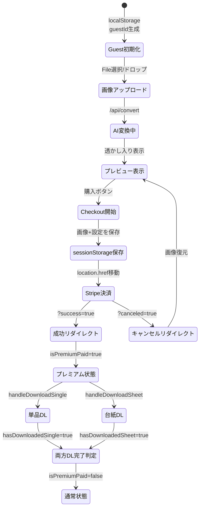
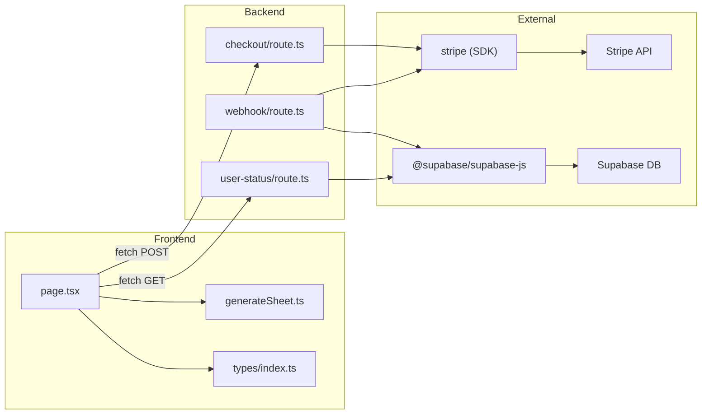

# Stripe決済統合 コードアーキテクチャ分析レポート

## 対象ファイル

| ファイル | 行数 | 役割 |
|---------|------|------|
| [checkout/route.ts](file:///Users/sekimotokaito/id-photo-converter/src/app/api/checkout/route.ts) | 41 | Checkout Session 作成 |
| [webhook/route.ts](file:///Users/sekimotokaito/id-photo-converter/src/app/api/webhook/route.ts) | 75 | Stripe Webhook 受信・DB記録 |
| [user-status/route.ts](file:///Users/sekimotokaito/id-photo-converter/src/app/api/user-status/route.ts) | 38 | 決済ステータス照会 |
| [page.tsx](file:///Users/sekimotokaito/id-photo-converter/src/app/page.tsx) | 908 | UI・状態管理・ダウンロードロジック |

---

## 1. コアロジックの要約

### 解決している問題
AI生成された証明写真に「透かし（PREVIEW SAMPLE）」を焼き込み、Stripe決済後にのみ透かしなし画像を**1回限り**ダウンロードさせるフリーミアムモデル。

### 主要アルゴリズム
- **透かし焼き込み**: Canvas APIで画像描画 → 25度回転のテキストオーバーレイを3行配置
- **一回きり権限管理**: React state (`isPremiumPaid`) をセッション変数として使用、両方のDL完了後に`useEffect`で消費
- **決済間のデータ永続化**: `sessionStorage` に変換画像（Base64）と設定値を保存し、Stripeリダイレクト後に復元

---

## 2. データフローと状態遷移



### 状態変数一覧

| 変数 | 型 | 永続化 | 説明 |
|------|-----|--------|------|
| `guestId` | `string` | localStorage | ゲスト識別子 |
| `isPremiumPaid` | `boolean` | なし（React state） | プレミアム権限フラグ |
| `hasDownloadedSingle` | `boolean` | なし | 単品DL済み |
| `hasDownloadedSheet` | `boolean` | なし | 台紙DL済み |
| `convertedImage` | `string` | sessionStorage（一時的） | Base64変換画像 |

---

## 3. 依存関係の可視化



> [!NOTE]
> `user-status/route.ts` は現在フロントエンドから**呼ばれていない**（一回きりモデルへ移行時にDB永続チェックを削除済み）。デッドコードとなっている。

---

## 4. エラーハンドリングと境界条件

### ✅ 良い点
- Webhook署名検証が正しく実装されている（`constructEvent`）
- `STRIPE_WEBHOOK_SECRET` 未設定時の早期リターン
- API Route全般で `try-catch` + 適切なHTTPステータスコード

### ⚠️ 問題点・エッジケース

| 問題 | 影響度 | 説明 |
|------|--------|------|
| **sessionStorage上限** | 🟡 中 | 高解像度画像の場合、変換画像がBase64で5MBを超える可能性がある。現在は台紙を除外して軽減したが、変換画像自体が大きい場合は未対処 |
| **Webhookのリトライ** | 🟡 中 | Stripeは失敗時に最大3日間リトライする。`payments` テーブルに `stripe_checkout_session_id` の UNIQUE制約がないため、同一決済が**重複挿入**される恐れがある |
| **img.onloadのエラーハンドリング** | 🟠 低 | `handleDownloadSingle` で `img.onerror` ハンドラが未定義。壊れた画像URLの場合Promiseが永遠にpendingになる |
| **guestId の改ざん** | 🔴 高 | クライアント側 `localStorage` の `guestId` を自由に変更可能。他人のguestIdを設定すれば、そのユーザーの決済状態を乗っ取れる（ただし一回きりモデルでは影響は限定的） |
| **PromoCode ハードコード** | 🔴 高 | `'20230322'` がフロントエンドにハードコードされており、ソースコード閲覧で誰でも利用可能 |

---

## 5. パフォーマンスと拡張性

### パフォーマンス

| 項目 | 現状 | 懸念 |
|------|------|------|
| Base64画像のReact State | 数MB | 大画像で再レンダリング時のメモリ消費増大 |
| Canvas透かし描画 | O(1) | 問題なし |
| sessionStorage I/O | 同期的 | メインスレッドブロック（数MB書き込み時） |
| `page.tsx` 908行 | モノリシック | 状態管理・UI・ビジネスロジックが混在 |

### 拡張性の課題
- **状態管理**: 14個以上の `useState` が1コンポーネントに集中。カスタムフックや Zustand への分離が必要
- **コンポーネント分割**: エディタ、プレビュー、CTA、設定パネルを分離すべき
- **環境変数のPrice ID直書き**: 商品追加時にコード変更が必要

---

## 6. 改善案

### 6-1. 🔴 セキュリティ: PromoCodeの環境変数化

```diff
- const isPremium = promoCode === '20230322' || isPremiumPaid;
+ const isPremium = promoCode === process.env.NEXT_PUBLIC_PROMO_CODE || isPremiumPaid;
```

`.env.local` に `NEXT_PUBLIC_PROMO_CODE=20230322` を追加。ただし `NEXT_PUBLIC_` はクライアントに公開されるため、本格対応にはサーバー側での検証APIが必要。

---

### 6-2. 🟡 Webhook重複防止: UPSERT化

```typescript
// webhook/route.ts - handleCheckoutComplete内
const { error } = await supabaseAdmin
  .from('payments')
  .upsert(
    {
      guest_id: guestId,
      stripe_payment_intent_id: session.payment_intent as string,
      stripe_checkout_session_id: session.id,
      amount: session.amount_total ?? 0,
      currency: session.currency ?? 'jpy',
      status: 'succeeded',
    },
    { onConflict: 'stripe_checkout_session_id' }
  );
```

前提: `stripe_checkout_session_id` に UNIQUE制約を追加するSQLが必要。

---

### 6-3. 🟡 img.onload のタイムアウト付きPromise

```typescript
const loadImage = (src: string, timeoutMs = 10000): Promise<HTMLImageElement> => {
  return new Promise((resolve, reject) => {
    const img = new globalThis.Image();
    const timer = setTimeout(() => reject(new Error('画像の読み込みがタイムアウトしました')), timeoutMs);
    img.onload = () => { clearTimeout(timer); resolve(img); };
    img.onerror = () => { clearTimeout(timer); reject(new Error('画像の読み込みに失敗しました')); };
    img.src = src;
  });
};
```

---

### 6-4. 🟢 状態管理のカスタムフック分離

```typescript
// hooks/usePaymentState.ts
export function usePaymentState() {
  const [guestId, setGuestId] = useState<string | null>(null);
  const [isPremiumPaid, setIsPremiumPaid] = useState(false);
  const [hasDownloadedSingle, setHasDownloadedSingle] = useState(false);
  const [hasDownloadedSheet, setHasDownloadedSheet] = useState(false);
  // ... checkout, restore, consume ロジック
  return { guestId, isPremiumPaid, handleCheckout, consumeDownload, ... };
}
```

---

### 6-5. 🟢 Price IDの環境変数化

```diff
- const STRIPE_PRICE_ID = 'price_1T3bUPILEcT30IEP0nk0699l';
+ const STRIPE_PRICE_ID = process.env.STRIPE_PRICE_ID;
+ if (!STRIPE_PRICE_ID) {
+   return NextResponse.json({ error: 'Price ID not configured' }, { status: 500 });
+ }
```

---

## 総合評価

| 観点 | 評価 | コメント |
|------|------|---------|
| **機能性** | ⭐⭐⭐⭐ | 一回きりDL権限モデルが正しく動作 |
| **セキュリティ** | ⭐⭐ | PromoCodeハードコード、guestId改ざん可能 |
| **エラー耐性** | ⭐⭐⭐ | 基本的なtry-catchはあるが境界条件に弱い |
| **保守性** | ⭐⭐ | page.tsx 908行のモノリシック構造 |
| **拡張性** | ⭐⭐ | 状態管理が密結合、商品追加に非柔軟 |
| **パフォーマンス** | ⭐⭐⭐ | 大画像時のBase64処理に課題あり |
