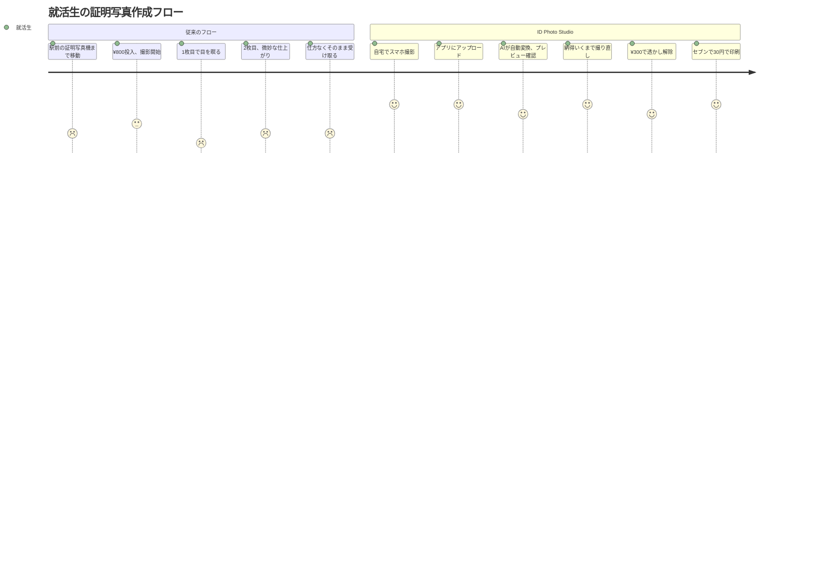

# 🎯 ID Photo Studio — ターゲットユーザー & ペルソナ分析

## 1. 想定ユーザーの属性（Who）

### コードから読み取れる根拠

| シグナル | ソース | 推定 |
|---------|--------|------|
| サイズプリセット: `passport`, `resume`, `mynumber`, `driver`, `visa` | `types.ts` L30-66 | **就活生・転職者、免許関連、行政手続き者** |
| 認証: なし（guestId = localStorage UUID） | `page.tsx` L69-74 | **ログイン不要 = 一見さん向け** |
| 組織構造: シングルユーザーのみ | DB Schema | **個人利用特化、BtoCモデル** |
| 価格: ¥300 ワンタイム | `checkout/route.ts` | **低単価 = 学生・若年層がターゲット** |
| LP訴求: 「圧倒的な安さ」「撮り直し放題」「タイパ」 | `page.tsx` L568-601 | **コスパ・時短重視層** |
| 台紙出力: 「セブンイレブンのマルチコピー機でL判印刷」 | `page.tsx` L783 | **コンビニ印刷ユーザー（自宅プリンタなし）** |
| 言語: 全テキスト日本語 | `layout.tsx` L23 | **日本国内ユーザー限定** |

### ユーザーセグメント

```
┌────────────────────────────────────────────────┐
│           ID Photo Studio ユーザー構成          │
│                                                │
│  ■ Primary（推定70%）                          │
│    就活生・転職活動中の20〜30代                  │
│    → 履歴書用写真が繰り返し必要                 │
│                                                │
│  ■ Secondary（推定20%）                        │
│    マイナンバーカード・免許更新の一般市民         │
│    → 年に1回程度の単発利用                      │
│                                                │
│  ■ Tertiary（推定10%）                         │
│    留学・ビザ申請者                             │
│    → サイズ規格が特殊、規格適合が重要           │
│                                                │
└────────────────────────────────────────────────┘
```

---

## 2. 解決している課題（Why / Pain Points）

### 機能 → ペインの逆算

| 実装されている機能 | 逆算される課題 |
|-----------------|--------------|
| AI背景透過 + スーツ着用変換 | 「自宅で撮った写真がそのまま使えない」|
| 複数サイズプリセット | 「用途ごとにサイズ規格が違い、毎回調べるのが面倒」|
| L判台紙自動生成 + 切り取り線 | 「写真機に行かなくてもコンビニで安く印刷したい」|
| ¥300ワンタイム、透かしプレビュー | 「仕上がりを確認してから払いたい（リスク回避）」|
| 明るさ・コントラスト補正 | 「暗い部屋で撮った写真の品質を上げたい」|
| ログイン不要（ゲストフロー） | 「アカウント作成が面倒、個人情報を渡したくない」|

### 競合比較で見える差別化

| | 証明写真機（Ki-Re-i等） | 写真館 | ID Photo Studio |
|---|---|---|---|
| 価格 | ¥800-1,000 | ¥1,500-3,000 | **¥300** |
| 場所 | 駅・スーパー | 店舗 | **どこでも** |
| 撮り直し | 数回まで | 数回まで | **無制限** |
| データ保存 | 追加料金 | 追加料金 | **無料** |
| 所要時間 | 移動+撮影で30分 | 予約+撮影で60分 | **5分** |

---

## 3. 主要なユースケース（When / How）

### ユーザーフロー分析



### API利用パターン

| エンドポイント | タイミング | 頻度 |
|-------------|---------|------|
| `POST /api/convert` | 写真変換実行時 | 1セッションあたり**1〜5回** |
| `POST /api/checkout` | 購入ボタン押下時 | 1セッションあたり**0〜1回** |
| `POST /api/webhook` | Stripe決済完了時 | 決済あたり**1回** |

---

## 4. プロダクトフェーズと市場価値（Value）

### 課金モデルの分析

| 要素 | 実装 | 示唆 |
|------|------|------|
| 課金タイミング | 変換後（プレビュー確認後） | **Try Before You Buy** モデル |
| 価格設定 | ¥300 固定 | **衝動買い閾値以下**（500円未満） |
| サブスクリプション | なし | **トランザクション課金 = LTV < CAC リスク** |
| リピート設計 | 一回きり権限 | **商品単位課金（写真1セット = 1決済）** |

### 価値の源泉

```
ユーザーが¥300を払う理由:

  「証明写真機 ¥800」vs「このアプリ ¥300 + コンビニ印刷 ¥30」

  → 差額 ¥470 の節約
  → 移動時間30分の節約
  → 撮り直し無制限の安心感
  → 仕上がり確認後に支払える低リスク

  = 「こっちの方が合理的」という納得感
```

### フェーズ判定

| 指標 | 現状 | フェーズ |
|------|------|---------|
| 認証 | なし（ゲストのみ） | **MVP** |
| 課金 | ワンタイムのみ | **PMF探索中** |
| 分析 | なし（GAなし） | **Pre-Growth** |
| マルチプロダクト | 単一機能 | **Seed Stage** |

---

## 5. ペルソナ

### Persona A: 鈴木 美咲（22歳・就活生）

| 項目 | 詳細 |
|------|------|
| **職業** | 大学4年生、就活真っ最中 |
| **目標** | 10社以上にエントリー → 書類選考突破 |
| **日常** | 毎週2〜3社にESを提出。証明写真が頻繁に必要 |
| **課題** | 駅前の写真機に毎回¥800は痛い。バイト代で生活中 |
| **行動特性** | スマホネイティブ、TikTokで情報収集、コスパ重視 |
| **決定打** | 「¥300で何度も撮り直せて、セブンで30円印刷」→ 1回あたり¥330で完結 |
| **不安要素** | 「AIで作った写真、履歴書に使って大丈夫なの？」 |
| **理想の体験** | 自室でパジャマ → 上だけスーツ着る → 撮影 → 3分で完成 → 翌朝コンビニ印刷 |

> 💬 *「友達が教えてくれたアプリで証明写真作ったんだけど、800円の機械と全然変わらなかった。しかも300円。就活生の味方すぎる」*

---

### Persona B: 田中 浩二（45歳・会社員）

| 項目 | 詳細 |
|------|------|
| **職業** | 中堅メーカーの営業課長 |
| **目標** | 運転免許証の更新手続きを効率よく済ませたい |
| **日常** | 平日は忙しく、写真機に寄る暇がない |
| **課題** | 免許更新の写真を用意し忘れて、当日撮影の行列が嫌 |
| **行動特性** | Google検索で「証明写真 安い アプリ」で比較検討 |
| **決定打** | 「ログインなし・5分で完成・コンビニ印刷」の手軽さ |
| **不安要素** | 「サイズ規格合ってるかな？」「個人情報は大丈夫？」 |
| **理想の体験** | 日曜の夜に自宅で作成 → 月曜の朝にコンビニで印刷 → 昼休みに免許センター |

> 💬 *「妻に『あんた、免許の写真また忘れたの？』って言われて検索したらこのアプリ見つけた。5分で終わった。300円なら缶コーヒー2本分だし」*

---

## まとめ: プロダクトのポジショニング

```
               高品質
                 ↑
                 │
        写真館   │   ID Photo Studio
      (¥3,000)   │      (¥300)
                 │
  ─────────────┼──────────────→ 手軽さ
                 │
     証明写真機  │   スマホアプリ
      (¥800)     │    (無料・低品質)
                 │
               低品質
```

> **ID Photo Studio = 「写真館の品質を、証明写真機以下の価格で、自宅から5分で」実現するプロダクト。**
